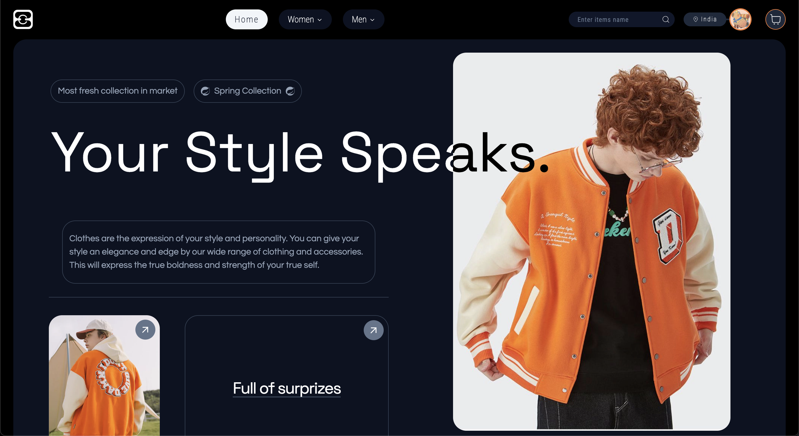
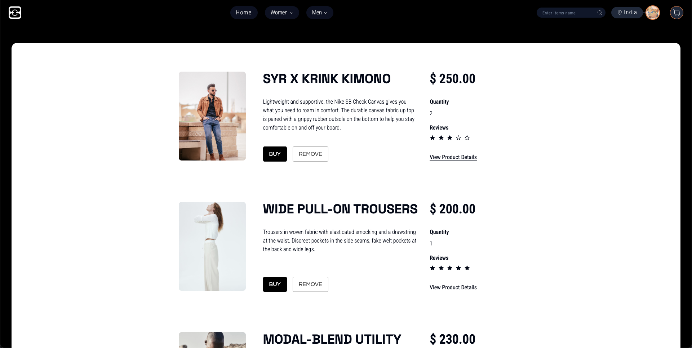

# ECE STORE  
Website [↗️](https://fuclothes.vercel.app/) (Click Here)

Welcome to ECE STORE, your go-to destination for futuristic fashion! 👗👖👟


## Getting Started 

<div align="center">

<h1>Fuclothes 👕🚀</h1>


</div>


Welcome to Fuclothes🤩, your gateway to futuristic 🧥👗👘🥻 designs! Explore the latest trends, concepts, and technologies shaping the future of fashion.
About Fuclothes

Fuclothes is a visionary project that blends cutting-edge technology with avant-garde fashion. Our mission is to redefine the boundaries of clothing design and inspire the next generation of fashion enthusiasts✌🏽.


## Run Locally

1. Clone the repository:
```bash
  git clone <link>
```
2. Navigate to the project directory: 
```bash 
cd fuclothes 
```
3. Install dependencies: 
```bash 
npm install
```
4. Start the development server: 
```bash
npm run dev
```

## Contribution guidelines

1. Fork the reepository😉

2. Raise an issue.
 
3. Run the project locally.

4. Fix the issue and raise a pull request.

5. Join the conversation by contributing your own designs, ideas, or feedback!


## Features

    🎨 Modern website layout.
    💡 Familiar Cart feature like e-commerece webbsite .
    🚀 Easy navigation through the website.
## What Challenges We Run Into


Building Fuclothes presented us with several exciting challenges that pushed us to innovate and find creative solutions. Some of the challenges we encountered include:


- `Responsive Design Across Devices`.

- `Optimizing Performance`: Balancing performance with functionality was crucial, particularly in optimizing page load times and reducing unnecessary server requests to enhance the user experience.

Despite these challenges, our team persevered and overcame each obstacle, resulting in a sleek and futuristic clothing store that we're proud to present to you today.
## Tech stacks
- 
- 

- 

- 
- 


## 🌟Contributors
    
<div style="display:flex; gap:20px;">
    <a src="linkedin.com/in/sayan-daas" align="center">
        
        <h5>Sayan Das ↗️</h5>
    </a>
    <a src="linkedin.com/in/supratim-dey-a4ab5b253">
        
        <h5>Supratim Dey ↗️</h5>
    </a>
    <a href="linkedin.com/in/soumit-srimany-4bb443241">
        
        <h5>Soumit Srimany ↗️</h5>
    </a>
    <a href="linkedin.com/in/sayan-banerjee-094600241">
        
        <h5>Sayan Banerjee ↗️</h5>
    </div>
</div>

## License

[MIT](https://choosealicense.com/licenses/mit/)

This project is licensed under the MIT License.


        

## Support

If you encounter any issues or have any questions about Fuclothes, please don't hesitate to reach out to us. You can contact our support team at support@fuclothes.com or open an issue here on [github](https://github.com/Sayan67/web_carfters_EC102C).

## Feedback

We'd love to hear your feedback on Fuclothes! If you have any questions, suggestions, or concerns, feel free to reach out to us at contact@fuclothes.com.
